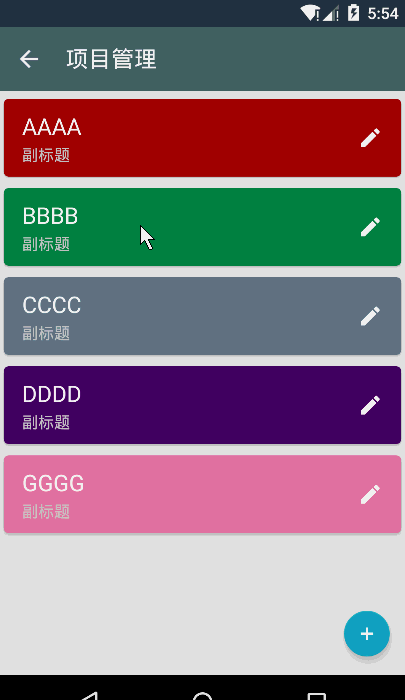
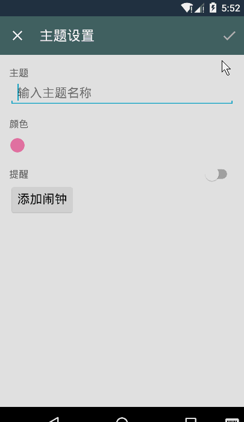
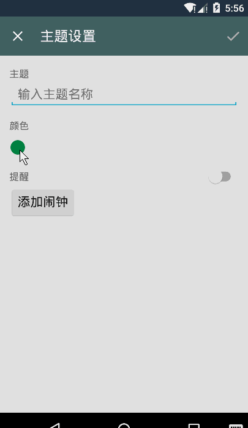
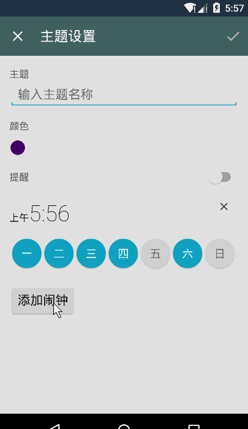

willpower-android
===============

一款带有番茄钟功能的ToDoList APP。设定任务主题，并在主题中添加子任务。主题和任务以周为一个循环，每天可以给自己设定不同的任务计划和提醒。并在数据库中记录每天任务的完成情况以及每天用去的时间。每个任务可以单独设定番茄模式来帮助自己提高集中力。适合需要坚持一个或几个长期计划的时候使用。比如减肥，锻炼，学英语之类的。

---

### 已实现功能

##### 透明标题栏

   

    
    
   

   
透明标题栏的低版本适配，修复Transparent status bar以及NavigationView的顶部在V21以下可能会变变黑白条的问题

##### RecyclerView的嵌套使用，以及子RecyclerView的展开
 
 

   
 

CardView中的子RecyclerView不能正常显示，需要重写LinearLayoutManager

##### 动态的自定义toolbar

 

   
 

EditText无内容时，保存菜单是灰色，有内容时是白色

##### ColorPick

   

ColorPickerDialog来自google源码<a href="https://android.googlesource.com/platform/frameworks/opt/colorpicker/">colorpick</a>

##### 主题中的闹钟每周提醒

   

灵感来自于google原生时钟<a href="https://android.googlesource.com/platform/packages/apps/DeskClock/">DeskClock</a>

TimePickerDialog来自于开源框架<a href="https://github.com/wdullaer/MaterialDateTimePicker">MaterialDateTimePicker</a>

自定义了button控件

##### 数据库及ContentProvider

在数据库中添加Project,Alarm表，并在ContentProvider中匹配相应的uri路径，在androidTest中完成数据库的单元测试

##### RecyclerViewAdapter中获取Cursor

  在 RecyclerViewAdapter中实现DataSetObserver，并加入swapCursor方法。方便配合LoaderManager来实现view和数据库的交互。
  
### 还未完成的功能

- Task设置界面
- 使用AlarmManager和NotificationManager实现主题的定时提醒功能。
- Task中的Timer界面。
- 用Viewpager来展现每日/周/月的时间记录，每次加载5个页面，多余的回收。
- 一些UI的填充和优化，以及一些细节设置。
- 桌面小部件
